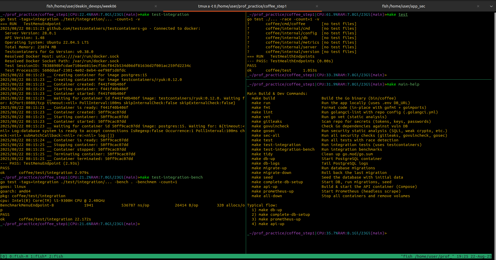
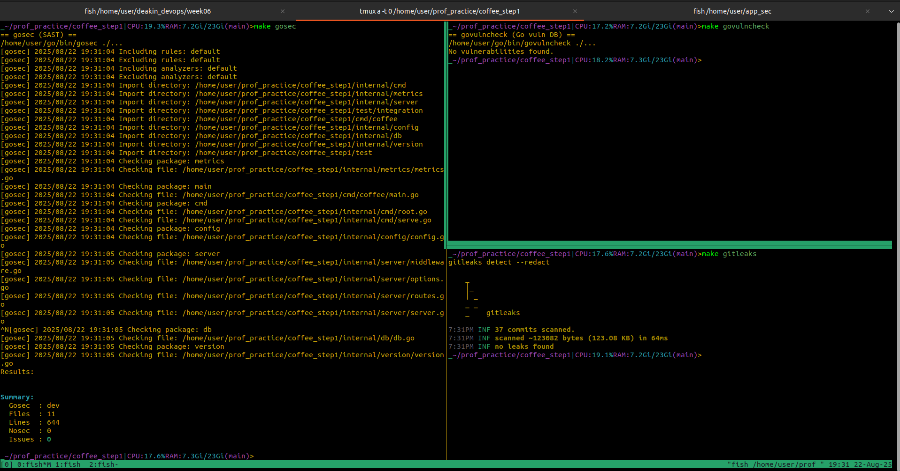
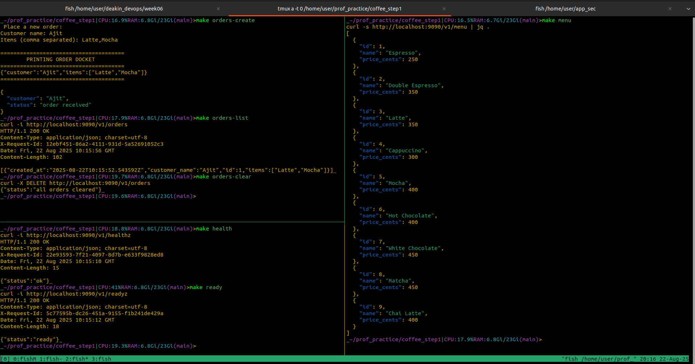
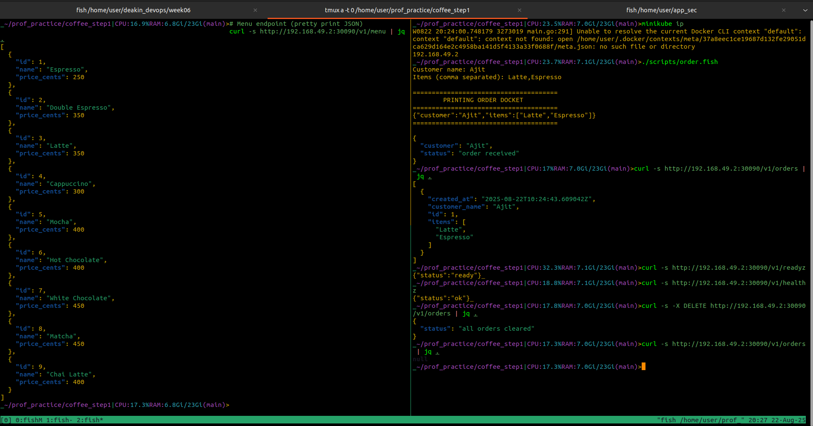
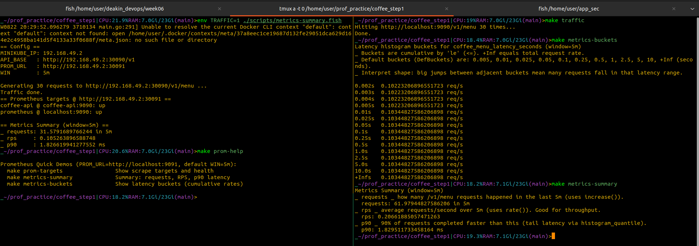
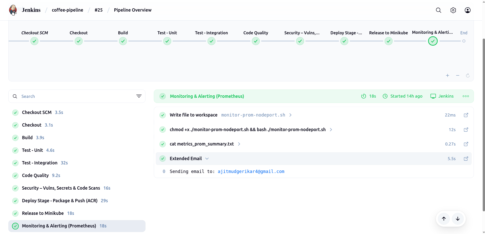

# Coffee Shop API

A minimal, production‑ready HTTP API for a coffee shop domain, written in Go with Gin, PostgreSQL, and Prometheus metrics. The repo supports **clean local development** (via `make` and Docker Compose) and **repeatable CI/CD** (via Jenkins), plus Minikube deployment.

---

## Visual Overview (Pipeline Stages)

### Build, Unit & Integration Tests



### Security & Vulnerability Scanning



### API Endpoint Testing with Local Makefile



### Release Testing in Minikube



### Prometheus Monitoring in Production and Local



### Jenkins Pipeline Overview



---

## Endpoints

* `GET  /v1/healthz` – liveness
* `GET  /v1/readyz` – readiness
* `GET  /v1/menu` – list menu items
* `POST /v1/orders` – create an order `{customer, items[]}`
* `GET  /v1/orders` – list orders
* `DELETE /v1/orders` – clear all orders
* `GET  /metrics` – Prometheus metrics

---

## CI/CD flow (Jenkins) ↔ local dev (`make`)

The pipeline mirrors day‑to‑day development. Each Jenkins stage corresponds to local `make` targets:

* **Build** → `make build`
* **Test – Unit** → `make test`
* **Test – Integration** → `make test-integration` and `make test-integration-bench`
* **Code Quality** → `make fmt`, `make lint`, `make vet`
* **Security** → `make gitleaks`, `make govulncheck`, `make gosec` (or `make sec-all`)
* **Deploy** → builds and tags Docker images, then pushes them to Azure Container Registry (ACR). This stage ensures a versioned, immutable artefact is available for downstream environments.
* **Release** → applies k8s/ manifests to Minikube, which here simulates the production release environment. The manifests are configured to pull images from ACR using injected credentials (imagePullSecret). This mimics a real production rollout where the cluster fetches containers from a trusted registry.
* **Monitoring** → deploys Prometheus inside Minikube (via k8s/prometheus*.yaml) to observe the released app. The Jenkins stage drives in‑cluster monitoring.(see console output for reference)

Build & run instructions: refer to the Makefile targets. They print short, actionable descriptions and are intended to be self‑explanatory. Screenshots of outputs are included in assets/.

### Note on Release

Currently, **release is tied to Minikube** as the local cluster. The Jenkins pipeline applies manifests under `k8s/` (Postgres, API, Prometheus) and updates the `coffee-api` Deployment image. For production, the same manifests can be adapted for cloud clusters by swapping NodePort services for LoadBalancer or Ingress.

---

## What each package provides (flexibility by design)

* **`internal/server`** — HTTP engine, middleware, routing, and `/metrics` exposure. Routes are conditionally registered only when dependencies (e.g., DB) are injected.
* **`internal/db`** — DB connection helper. Works with real DSNs in prod and Testcontainers in tests.
* **`internal/config`** — Viper loader merging defaults → config file → env → flags. A single source of truth for tunables.
* **`internal/metrics`** — Prometheus collectors. Centralized metric definitions for consistent observability.
* **`cmd/coffee`** — CLI entry (Cobra). `coffee serve` wires config/env/flags and starts the server.
* **`k8s/`** — manifests for API, Postgres, Prometheus. NodePort setup for Minikube, adaptable for other clusters.
* **`ops/`** — Prometheus config for Docker Compose.
* **`scripts/`** — helpers for demo flows (orders, metrics).

---

## Functional options: prod vs tests

This project constructs the HTTP server with **functional options** (see `internal/server/options.go`).

**Production config**:

```go
s := server.NewServer(
  server.WithAddr(":9090"),
  server.WithTimeouts(read, write, idle),
  server.WithShutdownTimeout(shutdown),
  server.WithDB(db),
  server.WithAccessLog(),
  server.WithGinMode(gin.ReleaseMode),
)
```

**Test config**:

```go
s := server.NewServer(
  server.WithGinMode(gin.TestMode),   // quiet, deterministic router
  // No addr/timeouts needed when using httptest
  // DB injected only when an integration test requires it
  // No access log by default to reduce noise
)
eng := s.Engine() // used with httptest.NewServer or directly via ServeHTTP
```

**What’s different?**

* **Runtime mode**: tests use `gin.TestMode`; prod uses `gin.ReleaseMode`.
* **Networking**: tests don’t bind real ports (use `httptest`); prod listens on `COFFEE_ADDR`.
* **Dependencies**: tests inject only what’s needed; prod injects DB, timeouts, access logs.
* **Observability**: tests omit access logging; prod enables it.
* **Shutdown**: prod uses configured timeouts; tests rely on runner lifecycle.

The same server object serves both worlds, tuned by options.

---

## Testing philosophy

* **Unit tests** use `gin.TestMode` + `httptest` for fast, in‑memory checks.
* **Integration tests** spin up Postgres with Testcontainers, apply migrations/seed, and exercise `/v1/menu` end‑to‑end.
* **Benchmarks** track latency, allocations, and memory per request to prevent regressions.

---

## Observability

* Structured access logs via `slog` (enabled with `WithAccessLog()`).
* Prometheus metrics at `/metrics`. Queried via Makefile helpers (`metrics-summary`, `metrics-buckets`).

---
